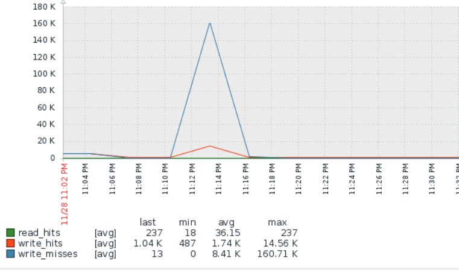

# LVM Cache monitoring template for [zabbix](https://github.com/zabbix/zabbix)
## Short info
 - Compatible with new Zabbix 7.0 ( or older versions 4.4+)

## What do these values mean?
 Details about monitored values described in Linux Kernel Documentation https://www.kernel.org/doc/Documentation/device-mapper/cache.txt

## Screenshot

## Usage
1. Put file `lvmcache.conf` to `/etc/zabbix/zabbix_agent.d/`.
2. Put file `sudoers_lvmcache` to `/etc/sudoers.d/` (you need `sudo` program installed).
3. Put file `lvmcache` to /etc/zabbix/scripts/. Then you can execute this file and test output. This script produces JSON output.
4. Import the
   [`lvmcache_template_7.0.yaml`](lvmcache_template_7.0.yaml) or ( [`lvmcache_template.xml`](lvmcache_template.xml) for older Zabbix versions ) into your Zabbix server (click on the `Raw` button to download).
5. Add the template to your host.
6. Check if new data arrives at Last Data section and Graphs.

This script assumes that you have ONLY ONE  caching device and polls the first device. Therefore, it does not require configuration and specifying a device name.
Working with disks implies elevated privileges and therefore you need do not forget about sudoers_zabbix_lvmcache file.

## Commands for debugging
 - dmsetup status
 - /etc/zabbix/scripts/lvmcache
 - zabbix_get -s  192.168.1.1 -k 'lvmcache.raw' (on zabbix server or zabbix proxy)

## License
This template is free software: you can redistribute it and/or modify it under
the terms of the GNU Affero General Public License as published by the Free
Software Foundation, version 3 of the License.
